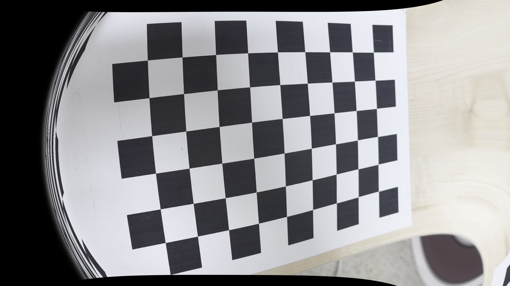

## Camera Calibration & Lens Distortion Correction

A simple camera calibration and distortion correction project using OpenCV.  
It extracts chessboard corners from images, calculates camera intrinsics, and performs lens distortion correction.

---

### Chessboard Information

- 내부 코너 수: **9 × 6** (가로 10칸 × 세로 7칸)
- 캘리브레이션에 사용된 프레임 수: *총 26장*

---

### Camera Calibration Results

```plaintext
fx = 1662.27  
fy = 1663.99  
cx = 952.06  
cy = 542.80
```

- **Distortion Coefficients** (k1, k2, p1, p2, k3)  
```plaintext
[0.2060, -0.5026, -0.00009, -0.00277, -0.4573]
```

- **RMSE (Reprojection Error)**: `0.0548`

---

### Distortion Correction Demo

| Before | After |
|--------|-------|
|  |  |

> 왜곡된 이미지를 보정하여, 곡선이 펴지고 격자가 더욱 정렬되었음을 확인할 수 있습니다.

---

### 🛠 How to Run

```bash
# 카메라 캘리브레이션 수행
python3 camera_calibration.py

# 렌즈 왜곡 보정
python3 distortion_correction.py
```

> 📂 `frames/` 폴더에 캘리브레이션용 이미지(.jpg)를 넣고 실행해주세요.
